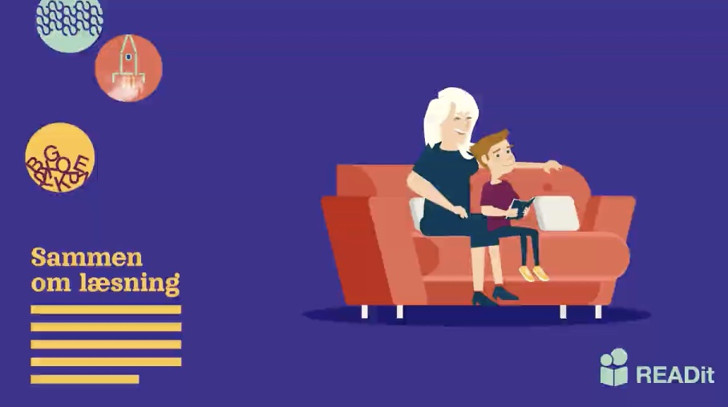

# The READit project

READit is a research project aimed at understanding how shared book reading interventions can be made effective at large scale. The project involves potentiallly 500 schools and 40,000 families in Denmark.

To adhere to the norms of open science, this project website makes publicly available information about the project. At the [github repository](https://github.com/simon-calmar-andersen/READit) all amendments to the project website can be tracked.

At the [project page](https:simon-calmar-andersen.github.io/READit/project) general information about the project may be found including a summary of the application.

The project is funded by DKK 20 million from The Novo Nordic Foundation.

